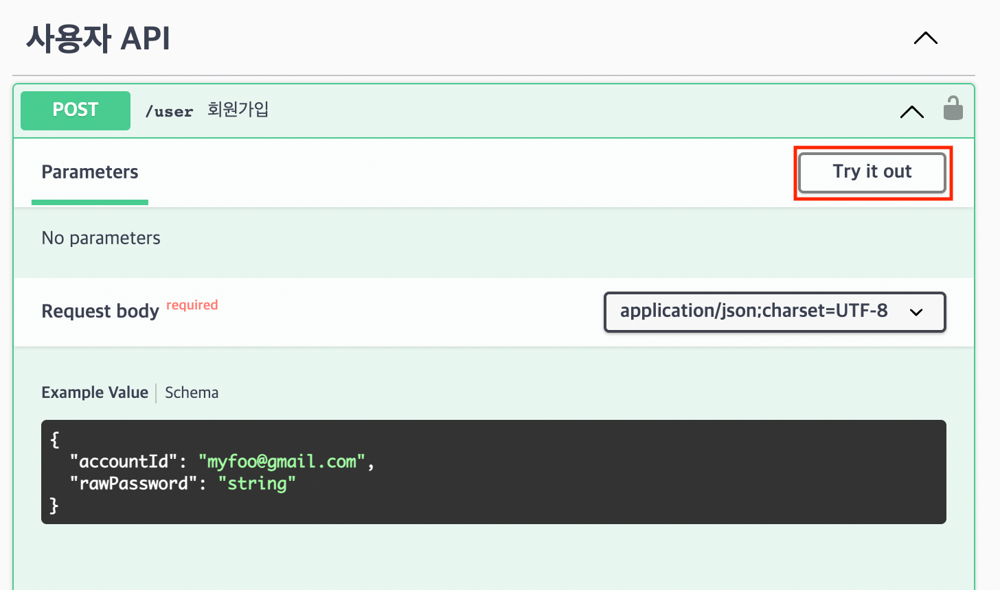
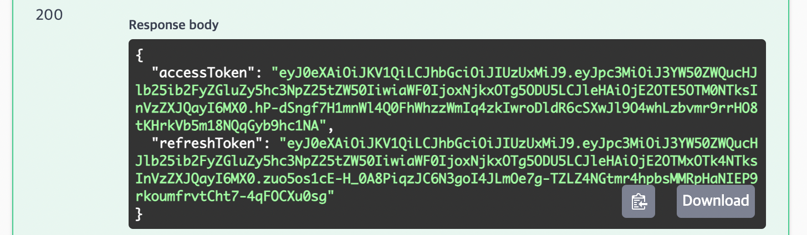
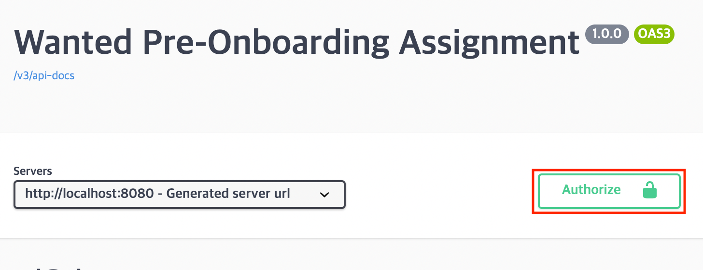
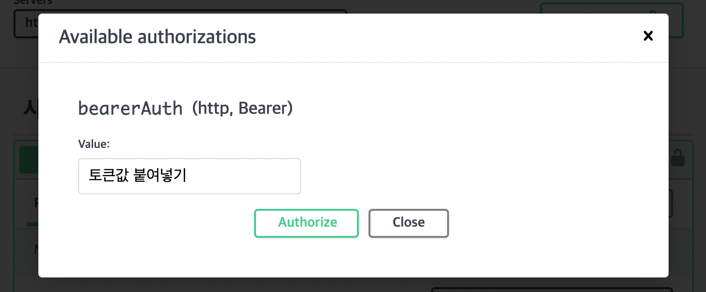
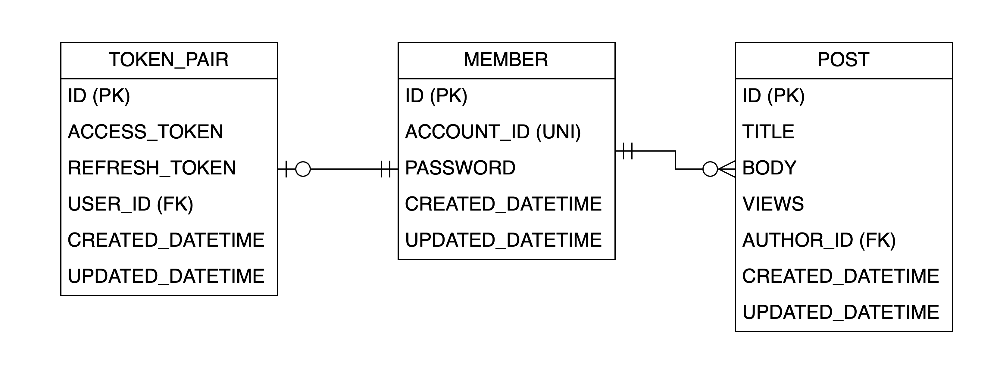
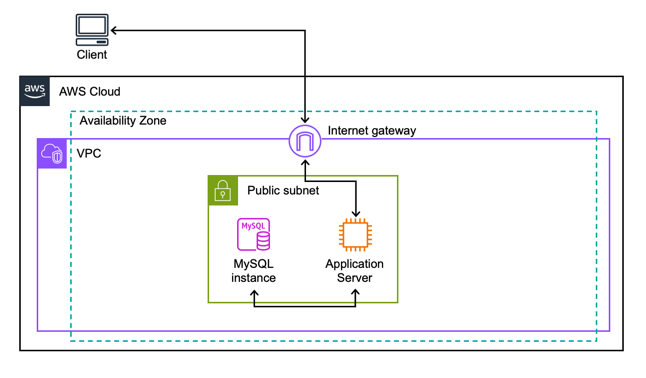

# 지원자 우태균 원티드 23년 08월 백엔드 인턴십 사전과제

## Application 실행 방법

먼저 깃허브에서 프로젝트를 가져옵니다.

```shell
git clone https://github.com/TaegyunWoo/wanted-pre-onboarding-backend.git
```

그 후, Gradle을 사용해 빌드를 진행합니다.

```shell
cd ./wanted-pre-onboarding-backend

./gradlew build
```

빌드가 완료되면 jar 파일을 실행합니다.

### AWS의 RDS(MySQL)를 DB로 사용하는 경우

```shell
java -jar -Dspring.profiles.active="staging" ./build/libs/assignment-0.0.1-SNAPSHOT.jar
```

위처럼 profile을 "staging"으로 설정해 실행합니다.

### Local 환경에 설치된 MySQL을 DB로 사용하는 경우

먼저 Local 환경에 설치된 MySQL에 연결하기 위해, properties 파일을 수정해야 합니다.

```shell
vim ./src/main/resources/application-local-mysql.properties
```

위 명령어를 통해, vim 에디터로 properties 파일을 엽니다.

그리고 아래 속성들의 값을 실행할 로컬 환경에 맞춰 변경합니다.

- `spring.datasource.url` : MySQL 연결 주소
- `spring.datasource.username` : MySQL 접근 아이디
- `spring.datasource.password` : MySQL 접근 비밀번호

그리고 jar 파일을 실행합니다.

```shell
java -jar -Dspring.profiles.active="local-mysql" ./build/libs/assignment-0.0.1-SNAPSHOT.jar
```

위처럼 profile을 "local-mysql"으로 설정해 실행합니다.

### 내장 H2를 DB로 사용하는 경우

해당 Application에는 내장 H2 DB가 존재합니다.

따라서, 아래와 같이 실행할 수 있습니다.

```shell
java -jar -Dspring.profiles.active="local-h2" ./build/libs/assignment-0.0.1-SNAPSHOT.jar
```

이때 H2 DB 콘솔은 브라우저에서 아래 URL을 입력해 접속할 수 있습니다.

```text
http://localhost:8080/h2-console
```

그리고 해당 콘솔 화면에서 아래 필드들을 다음과 같이 채우면 됩니다.

- `JDBC URL` : `jdbc:h2:mem:~/preonboarding`
- `User Name` : `sa`
- `Password` : 공란

## 엔드포인트 호출 방법

### Swagger 접속

Swagger를 사용하여, 원하는 엔드포인트를 호출할 수 있습니다.

아래 URL로 Swagger에 접속합니다.

```text
http://localhost:8080/swagger
```

### API 호출



위 그림의 `Try it out` 버튼을 눌러서, 직접 입력값을 전달해 실행하고, 그 결과를 확인해볼 수 있습니다.

### 인증/인가

먼저 회원가입·로그인을 해야 합니다.

로그인 API를 정상적으로 호출하면, 아래와 같이 Access Token과 Refresh Token이 응답으로 돌아옵니다.



여기에서 `accessToken` 필드에 담긴 토큰값을 복사해, 아래처럼 붙여넣습니다.





이 후, 발생하는 모든 요청의 헤더에 토큰값이 아래처럼 포함됩니다.

```text
Authorization: Bearer 붙여넣은_토큰값
```

## DB 테이블 구조



- `MEMBER` 테이블
  - 회원 정보
- `POST` 테이블
  - 게시글 정보
  - `MEMBER`·`POST` : 일대다 관계
- `TOKEN_PAIR` 테이블
  - 발급한 토큰(JWT) 정보
  - `MEMBER`·`TOKEN_PAIR` : 일대일 관계

## 데모 영상

Youtube

## 구현 방법

### Stack

- Java 17
- Spring Boot 2.7.14
- Gradle 8.2.1
- 개발 환경
  - Processor : Arm64
  - OS : macOS Monterey 12.6
  - DB : H2, MySQL 8.0
- AWS 배포 환경
  - EC2, RDS(MySQL)

### Library

- `spring-boot-starter-web` : Web MVC Application 구현
- `spring-boot-starter-security` : 비밀번호 암호화 모듈을 사용
- `spring-boot-starter-validation` : 입력값 검증 자동화
- `spring-boot-starter-data-jpa` : Hibernate ORM 사용
- `springdoc-openapi-ui` : Swagger 사용
- `mapstruct` : Entity·DTO 간 객체 매핑 자동화
- `jjwt` : JWT 사용
- `mysql-connector-java` : MySQL DB 연결
- `lombok` : 보일러플레이트 코드 자동화
- `h2` : 내장 DB

### Implementation

- 회원가입·로그인 아이디, 비밀번호 검증
  - `spring-boot-starter-validation` 라이브러리를 사용해, `@` 값 검증 및 `8자 이상` 조건 검증
- 인가/인증
  - 로그인 시, Access·Refresh 토큰쌍 발급 및 DB에 저장
  - 보안 강화를 위해, Access 토큰의 만료기간은 1시간, Refresh 토큰의 만료기간은 2주로 설정
  - Access 토큰이 만료되고 Refresh 토큰이 만료되지 않은 경우, 토큰 재발급 API를 통해 토큰쌍 재발급 가능
  - 비정상 접근으로 의심되는 계정의 모든 인가를 거부하기 위해, 발급한 토큰은 모두 DB에서 관리 (DB에 저장된 토큰 제거시, 해당 토큰으로의 인가 요청은 모두 거부)
    - 비정상 접근 : `아직 Access Token이 만료되지 않았는데, 재발급을 요청한 경우`, `시그니처가 올바르지 않은 경우`
- 토큰 관리 DB
  - 성능상 유리한 Redis를 사용하고자 했으나, Redis 사용이 어려운 로컬환경(Windows 등)에서도 Application을 실행하여 테스트할 수 있도록 MySQL을 사용
- 게시글 작성
  - 제목 길이 검증 : 최소 1자, 최대 255자
  - 본문 길이 검증 : 최소 1자
  - 인증된 사용자만 접근 가능
- 게시글 목록 조회
  - Cursor 기반 페이징 적용
  - `OFFSET`을 사용하지 않아, 성능 개선 가능
  - 무한 스크롤 UI 구현 시, 중복 게시글 노출 방지 가능 (다음 페이지 조회시, 이전 페이지의 게시글 중복 X)
  - 인증된 사용자만 접근 가능
- 특정 게시글 조회
  - 요청 시, 조회수 증가
  - 인증된 사용자만 접근 가능
- 특정 게시글 수정
  - 로그인된 사용자와 작성자를 비교해, 로그인된 사용자가 작성자인 경우에만 허용
  - 수정된 제목 길이 검증 : 최소 1자, 최대 255자
  - 수정된 본문 길이 검증 : 최소 1자
  - 인증된 사용자만 접근 가능
- 특장 게시글 삭제
  - 로그인된 사용자와 작성자를 비교해, 로그인된 사용자가 작성자인 경우에만 허용
  - 인증된 사용자만 접근 가능

### Details
- 로그인된 사용자의 정보를 컨트롤러의 파라미터로 받아, 다루기 쉽게끔 Argument Resolver를 추가함.
  - `wanted/preonboarding/assignment/controller/resolver/LoginUserArgumentResolver`
- 상세 오류코드를 하나의 Enum에서 관리
  - `wanted/preonboarding/assignment/exception/ErrorCode`

### AWS

- `URL` : http://13.209.145.13
- `API 명세 (Swagger)` : http://13.209.145.13/swagger



## API 명세

> Swagger를 통해서도, API 명세를 확인해볼 수 있음  
[http://13.209.145.13/swagger](http://13.209.145.13/swagger)

### 전체 API

| Method | EndPoint        | Description | Request/Response                                          |
|--------|-----------------|-------------|-----------------------------------------------------------|
| POST   | /user           | 회원가입        | [회원가입 Request/Response](#회원가입-request-response)           |
| POST   | /user/sign-in   | 로그인         | [로그인 Request/Response](#로그인-request-response)             |
| POST   | /user/token     | 토큰 재발급      | [토큰 재발급 Request/Response](#토큰-재발급-request-response)       |
| GET    | /posts          | 게시글 목록 조회   | [게시글 목록 조회 Request/Response](#게시글-목록-조회-request-response) |
| POST   | /posts          | 새 게시글 생성    | [새 게시글 생성 Request/Response](#새-게시글-생성-request-response)   |
| GET    | /posts/{postId} | 특정 게시글 조회   | [특정 게시글 조회 Request/Response](#특정-게시글-조회-request-response) |
| PATCH  | /posts/{postId} | 특정 게시글 수정   | [특정 게시글 수정 Request/Response](#특정-게시글-수정-request-response) |
| DELETE | /posts/{postId} | 특정 게시글 삭제   | [특정 게시글 삭제 Request/Response](#특정-게시글-삭제-request-response) |


### 회원가입 Request Response

- Request
  ```json
  {
    "accountId": "회원가입할 계정 ID",
    "rawPassword": "회원가입할 계정 비밀번호"
  }
  ```
- Response
  - 200 : 회원가입 성공
- Error Response
  - 400 : 입력 형식 오류, 조건사항 비만족, 아이디 중복
  ```json
  {
    "message": "오류메시지",
    "code": "오류코드",
    "fieldErrors": [
      {
        "field": "오류가 발생한 필드명1",
        "reason": "오류 메시지"
      }, ...
    ]
  }
  ```

### 로그인 Request Response

- Request
  ```json
  {
    "accountId": "로그인할 계정 ID",
    "rawPassword": "로그인할 계정 비밀번호"
  }
  ```
- Response
  - 200 : 로그인 성공
  ```json
  {
    "accessToken": "Access 토큰값",
    "refreshToken": "Refresh 토큰값"
  }
  ```
- Error Response
  - 400 : 입력 형식 오류, 조건사항 비만족, 아이디 중복
  - 401 : 잘못된 로그인 정보
  ```json
  {
    "message": "오류메시지",
    "code": "오류코드",
    "fieldErrors": [
      {
        "field": "오류가 발생한 필드명1",
        "reason": "오류 메시지"
      }, ...
    ]
  }
  ```

### 토큰 재발급 Request Response

- Request
  ```json
  {
    "expiredAccessToken": "만료된 Access Token",
    "validRefreshToken": "유효한 Refresh Token"
  }
  ```
- Response
  - 200 : 토큰 재발급 성공
  ```json
  {
    "accessToken": "재발급된 Access 토큰값",
    "refreshToken": "재발급된 Refresh 토큰값"
  }
  ```
- Error Response
  - 401 : 비정상 토큰이나 발급한 적 없는 토큰으로 요청, 아직 Access Token이 만료되지 않은 경우, Refresh Token이 만료된 경우
  ```json
  {
    "message": "오류메시지",
    "code": "오류코드",
    "fieldErrors": [
      {
        "field": "오류가 발생한 필드명1",
        "reason": "오류 메시지"
      }, ...
    ]
  }
  ```

### 게시글 목록 조회 Request Response

- Request
  ```text
  ?cursorId=기준_페이지_ID&pageSize=페이지당_게시글수
  ```
  > 만약 기준 페이지 ID가 `-1`이라면, 가장 최근 글부터 조회
- Response
  - 200 : 게시글 목록 조회 성공
  ```json
  [
    {
      "id": "게시글_ID",
      "title": "게시글 제목",
      "views": "조회수",
      "author": {
        "id": "작성자_ID",
        "accountId": "작성자_계정_ID"
      },
      "createdDate": "생성일",
      "modifiedDate": "수정일"
    }, ...
  ]
  ```
- Error Response
  - 400 : 입력 형식 오류
  - 401 : 인증되지 않은 사용자
  ```json
  {
    "message": "오류메시지",
    "code": "오류코드",
    "fieldErrors": [
      {
        "field": "오류가 발생한 필드명1",
        "reason": "오류 메시지"
      }, ...
    ]
  }
  ```

### 새 게시글 생성 Request Response

- Request
  ```json
  {
    "title": "새 게시글 제목",
    "body": "새 게시글 본문"
  }
  ```
- Response
  - 200 : 새 게시글 등록 성공
- Error Response
  - 400 : 입력 형식 오류, 조건사항 비만
  - 401 : 인증되지 않은 사용자
  ```json
  {
    "message": "오류메시지",
    "code": "오류코드",
    "fieldErrors": [
      {
        "field": "오류가 발생한 필드명1",
        "reason": "오류 메시지"
      }, ...
    ]
  }
  ```

### 특정 게시글 조회 Request Response

- Request
  ```text
  /posts/{조회할_게시글_Id}
  ```
- Response
  - 200 : 게시글 조회 성공
  ```json
  {
    "id": "조회된 게시글 ID",
    "title": "조회된 게시글 제목",
    "body": "조회된 게시글 본문",
    "views": "조회수",
    "author": {
      "id": "작성자 ID",
      "accountId": "작성자 계정 ID"
    },
    "createdDate": "생성일",
    "modifiedDate": "수정일"
  }
  ```
- Error Response
  - 400 : 입력 형식 오류
  - 401 : 인증되지 않은 사용자
  - 404 : 존재하지 않는 게시글
  ```json
  {
    "message": "오류메시지",
    "code": "오류코드",
    "fieldErrors": [
      {
        "field": "오류가 발생한 필드명1",
        "reason": "오류 메시지"
      }, ...
    ]
  }
  ```

### 특정 게시글 수정 Request Response

- Request
  ```text
  /posts/{수정할_게시글_Id}
  ```
  ```json
  {
    "title": "수정된 게시글 제목",
    "body": "수정된 게시글 본문"
  }
  ```
- Response
  - 200 : 게시글 수정 성공
- Error Response
  - 400 : 입력 형식 오류
  - 401 : 인증되지 않은 사용자
  - 403 : 작성자와 불일치
  - 404 : 존재하지 않는 게시글
  ```json
  {
    "message": "오류메시지",
    "code": "오류코드",
    "fieldErrors": [
      {
        "field": "오류가 발생한 필드명1",
        "reason": "오류 메시지"
      }, ...
    ]
  }
  ```

### 특정 게시글 삭제 Request Response

- Request
  ```text
  /posts/{삭제할_게시글_Id}
  ```
- Response
  - 200 : 게시글 삭제 성공
- Error Response
  - 400 : 입력 형식 오류
  - 401 : 인증되지 않은 사용자
  - 403 : 작성자와 불일치
  - 404 : 존재하지 않는 게시글
  ```json
  {
    "message": "오류메시지",
    "code": "오류코드",
    "fieldErrors": [
      {
        "field": "오류가 발생한 필드명1",
        "reason": "오류 메시지"
      }, ...
    ]
  }
  ```